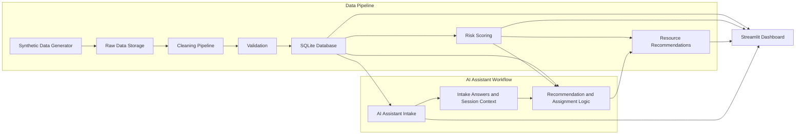
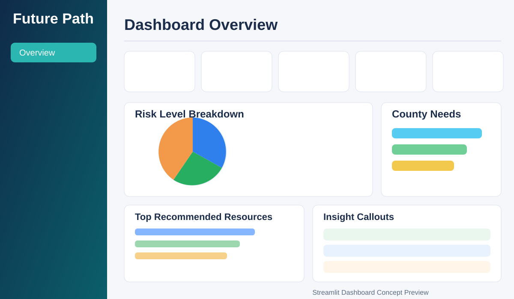

# Future Path

A data engineering + AI-assisted decision-support project focused on improving youth transition outcomes through clean data pipelines, transparent scoring, and actionable resource recommendations.

Quick overview for employers and instructors: [PROJECT_BRIEF.md](PROJECT_BRIEF.md)

## Project Overview

Future Path simulates a real-world workflow used by transition teams, instructors, and employers to understand youth needs and match support services quickly.

The project combines:

- Synthetic youth profile generation
- Data quality and validation pipelines
- Relational modeling in SQLite
- Risk scoring and recommendation logic
- AI Assistant intake workflow
- Streamlit dashboards for operational visibility

## Problem Statement

Youth transition support programs often struggle with fragmented data, inconsistent intake quality, and limited visibility into who needs what support first.

Future Path addresses these challenges by providing:

- A reproducible, privacy-aware data foundation
- Clear risk scoring rules that are auditable
- Structured recommendation and assignment workflows
- Dashboard views that make trends and priorities obvious

## Tech Stack

- Language: Python 3
- Data processing: pandas
- Database: SQLite
- Testing: pytest
- Dashboard/UI: Streamlit
- Data artifacts: CSV (raw, clean, processed)

## Project Architecture

Labels: documentation, architecture, diagram



### Core Data Flow

1. Generate synthetic youth and caseworker datasets
2. Clean public, caseworker, and resource catalog records
3. Load curated data into SQLite domain tables
4. Calculate risk scores per youth
5. Generate recommendations from risk + intake context
6. Assign resources from intake outcomes
7. Explore outcomes in dashboards and profile views

## Folder Structure

```text
Future-Path/
├── dashboard/
│   ├── overview.py
│   ├── profile_lookup.py
│   └── ai_assistant.py
├── data/
│   ├── raw/
│   ├── clean/
│   └── processed/
├── database/
│   └── relational_schema.sql
├── docs/
│   └── screenshots/
│       ├── dashboard-overview.svg
│       └── ai-assistant.svg
├── src/
│   ├── generate_synthetic_youth_data.py
│   ├── clean_synthetic_youth_data.py
│   ├── clean_caseworker_youth_data.py
│   ├── clean_youth_resource_catalog.py
│   ├── load_youth_data_to_database.py
│   ├── load_youth_profiles_etl.py
│   ├── calculate_risk_scores.py
│   ├── generate_recommendations.py
│   ├── future_path_ai_intake.py
│   ├── assign_resources_from_intake.py
│   ├── match_youth_to_resources.py
│   └── run_data_pipeline.py
├── tests/
├── requirements.txt
└── README.md
```

## How To Run

### Double-Click Launcher

On macOS, double-click [start.command](start.command) to migrate the database, run the pipeline, start all dashboard servers, and open the Overview dashboard.
You can also double-click [Future Path.app](Future%20Path.app) for the same behavior from Finder.

Current launcher behavior:
- Starts all dashboards up front (ports `8601`-`8605`) so switching is immediate
- Opens Overview first at `http://localhost:8601`
- Preloads all dashboard URLs at startup so pages are ready in the browser
- Keeps all dashboard servers running while the app session is active
- Automatically stops dashboard servers after all dashboard tabs/windows are closed
- Also stops all dashboard servers when you end the launcher session (Ctrl+C)

Optional: run `./start.command <dashboard_key>` to open a different dashboard first.
Valid keys: `overview`, `profile_lookup`, `ai_assistant`, `caseworker_dashboard`, `youth_dashboard`.

### 1. Install Dependencies

```bash
python3 -m pip install -r requirements.txt
```

### 2. Run End-To-End Pipeline

```bash
python3 src/run_data_pipeline.py
```

This command generates, cleans, loads, matches, and validates core pipeline outputs.

### 3. Optional Step-By-Step Pipeline

```bash
python3 src/generate_synthetic_youth_data.py
python3 src/clean_synthetic_youth_data.py
python3 src/clean_caseworker_youth_data.py
python3 src/clean_youth_resource_catalog.py
python3 src/load_youth_data_to_database.py
python3 src/load_youth_profiles_etl.py
python3 src/calculate_risk_scores.py
python3 src/generate_recommendations.py
python3 src/match_youth_to_resources.py
```

### 4. Run Streamlit Views

Overview dashboard:

```bash
streamlit run dashboard/overview.py
```

Youth profile lookup:

```bash
streamlit run dashboard/profile_lookup.py
```

AI Assistant intake UI:

```bash
streamlit run dashboard/ai_assistant.py
```

Caseworker workflow dashboard:

```bash
streamlit run dashboard/caseworker_dashboard.py
```

### 5. Migrate Older Databases (If Needed)

If your local database was created with an older schema and dashboard pages fail due to missing columns, run:

```bash
python3 src/migrate_database_schema.py --database database/future_path.db
```

### 6. Run Test Suite

```bash
pytest -q
```

Current expected result: all tests pass.

## 60-Second Demo Flow

Labels: demo, presentation

Use this script for a one-minute walkthrough of the project value and core features.

One-page speaker version: [docs/demo-cheat-sheet.md](docs/demo-cheat-sheet.md)

### Prep Before Presenting

Run once before the timed demo so the app is warm and ready:

```bash
python3 src/run_data_pipeline.py
streamlit run dashboard/overview.py
```

### Live Demo Script (60 Seconds)

1. 0:00-0:08 | Explain the problem
- "Youth transition programs often have fragmented data and limited visibility into who needs help first."
- "Future Path unifies data, scoring, and support recommendations in one workflow."

2. 0:08-0:15 | Run pipeline
- In terminal, run:

```bash
python3 src/run_data_pipeline.py
```

- Narration: "This generates synthetic records, cleans and validates data, loads SQLite tables, and computes matching outputs."
- If timing is tight, show the most recent successful pipeline terminal output from your prep run.

3. 0:15-0:25 | Open dashboard
- In browser, show Overview at `http://localhost:8601`.
- Narration: "This dashboard gives operational visibility across youth outcomes and support activity."

4. 0:25-0:33 | Show risk score
- Point to risk-level and risk-summary sections on Overview or Youth Dashboard.
- Narration: "Risk scoring is transparent and auditable, so teams can prioritize high-need youth."

5. 0:33-0:50 | Complete AI Assistant intake
- Navigate to AI Assistant and answer the guided questions quickly.
- Narration: "The intake captures structured answers and converts them into actionable need signals."

6. 0:50-1:00 | Show recommended resources
- Show generated recommendations with priority and contact details.
- Narration: "Recommendations combine risk context and intake responses, including phone/email/website for follow-through."

### Presenter Talking Points (Quick Reference)

- Problem: fragmented data slows support decisions.
- Solution: reproducible pipeline + AI-guided intake + explainable recommendations.
- Reliability: validation checks, SQLite persistence, and automated tests.
- Outcome: faster, clearer, and more actionable youth support planning.

### Screenshot Fallback (If Live Demo Fails)

Use these existing assets in order:

1. [docs/screenshots/dashboard-overview.svg](docs/screenshots/dashboard-overview.svg) for architecture outcome, dashboard, and risk overview.
2. [docs/screenshots/ai-assistant.svg](docs/screenshots/ai-assistant.svg) for intake workflow and recommendation handoff.

Optional: capture two additional backups before presenting:

- `docs/screenshots/risk-score-view.png`
- `docs/screenshots/recommended-resources-view.png`

## AI Assistant Explanation

Future Path AI Assistant is a guided intake workflow that asks structured questions one at a time and stores responses for downstream recommendations.

### What It Does

- Starts an intake session for youth or candidate profiles
- Captures standardized answers (not free-form sensitive details)
- Tracks completion progress and top need category
- Triggers recommendation and assignment logic
- Shows end-of-intake summary with prioritized supports

### Safety and Ethics

- Uses synthetic/demo data in this project context
- Decision-support only, not a crisis intervention tool
- Includes emergency guidance if safety concerns are reported
- Encourages minimal sensitive data collection

## How To Add A New Teen

Future Path now supports a candidate-first onboarding workflow so intake can happen before a full youth profile exists.

### Candidate-First Workflow

1. Open the Caseworker Dashboard
2. In Quick Actions, click **Start Candidate Intake**
3. In AI Assistant, choose **candidate** profile type and complete the intake session
4. Return to Caseworker Dashboard
5. In **Candidate Intake Promotion**, select the completed candidate intake
6. Fill in youth profile details (name, age, county, education, employment, housing, and related fields)
7. Confirm or edit the suggested Youth ID
8. Click **Promote Candidate To Teen**

What promotion does automatically:

- Creates a new row in `youth_profiles`
- Optionally writes first/last name into `caseworker_youth`
- Converts linked intake sessions from candidate to youth profile type
- Migrates candidate-linked assigned resources to the new youth ID
- Optionally assigns the new teen case to the active caseworker

### Where To Find Candidates Ready For Promotion

- Overview dashboard: **Candidates Waiting** KPI and **Candidate Queue** panel
- Caseworker dashboard: **Candidate Intake Promotion** section

## Dashboard Screenshots

### Dashboard Overview



### AI Assistant Intake Experience


## Testing and Quality

The test suite covers core logic across:

- Data cleaning and validation
- Risk scoring logic and persistence
- Recommendation generation and priorities
- AI intake response handling and summary logic
- Answer-to-need mapping and resource assignment inserts

Run targeted suites when needed:

```bash
pytest tests/test_data_pipeline.py -q
pytest tests/test_risk_scoring.py -q
pytest tests/test_recommendations.py -q
pytest tests/test_ai_intake.py -q
pytest tests/test_intake_resource_assignment.py -q
```

## Future Improvements

### Other Actions To Add Next

- Add one-click candidate ID generation in AI Assistant so caseworkers do not type IDs manually
- Allow selecting a candidate directly from Overview and opening Caseworker promotion with that candidate preselected
- Add a required-fields checklist and validation summary before final promotion submit
- Add an audit trail table for promotion events (who promoted, when, and from which candidate ID)
- Add optional duplicate checks (name + age + county) before creating a new youth profile
- Add notification banner for newly promoted teens visible to caseworkers on login

- Add role-based access and authentication for caseworker views
- Introduce configurable scoring weights and explainability panels
- Add trend dashboards (weekly/monthly deltas) for program outcomes
- Support export workflows (PDF summaries, CSV action lists)
- Add lightweight API layer for external integrations
- Expand UI test coverage for Streamlit interaction flows

## Project Purpose for Employers and Instructors

Future Path demonstrates practical capability in:

- End-to-end data engineering design
- Reproducible ETL and quality controls
- Applied analytics and recommendation systems
- Human-centered AI assistant workflow design
- Test-driven implementation and maintainability

It is designed to be reviewable as both a technical portfolio artifact and an instructional capstone-quality project.
