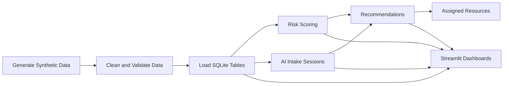

# Future Path

A data engineering + AI-assisted decision-support project focused on improving youth transition outcomes through clean data pipelines, transparent scoring, and actionable resource recommendations.

Quick overview for employers and instructors: [PROJECT_BRIEF.md](PROJECT_BRIEF.md)

## Project Overview

Future Path simulates a real-world workflow used by transition teams, instructors, and employers to understand youth needs and match support services quickly.

The project combines:

- Synthetic youth profile generation
- Data quality and validation pipelines
- Relational modeling in SQLite
- Risk scoring and recommendation logic
- AI Assistant intake workflow
- Streamlit dashboards for operational visibility

## Problem Statement

Youth transition support programs often struggle with fragmented data, inconsistent intake quality, and limited visibility into who needs what support first.

Future Path addresses these challenges by providing:

- A reproducible, privacy-aware data foundation
- Clear risk scoring rules that are auditable
- Structured recommendation and assignment workflows
- Dashboard views that make trends and priorities obvious

## Tech Stack

- Language: Python 3
- Data processing: pandas
- Database: SQLite
- Testing: pytest
- Dashboard/UI: Streamlit
- Data artifacts: CSV (raw, clean, processed)

## Project Architecture



### Core Data Flow

1. Generate synthetic youth and caseworker datasets
2. Clean public, caseworker, and resource catalog records
3. Load curated data into SQLite domain tables
4. Calculate risk scores per youth
5. Generate recommendations from risk + intake context
6. Assign resources from intake outcomes
7. Explore outcomes in dashboards and profile views

## Folder Structure

```text
Future-Path/
├── dashboard/
│   ├── overview.py
│   ├── profile_lookup.py
│   └── ai_assistant.py
├── data/
│   ├── raw/
│   ├── clean/
│   └── processed/
├── database/
│   └── relational_schema.sql
├── docs/
│   └── screenshots/
│       ├── dashboard-overview.svg
│       └── ai-assistant.svg
├── src/
│   ├── generate_synthetic_youth_data.py
│   ├── clean_synthetic_youth_data.py
│   ├── clean_caseworker_youth_data.py
│   ├── clean_youth_resource_catalog.py
│   ├── load_youth_data_to_database.py
│   ├── load_youth_profiles_etl.py
│   ├── calculate_risk_scores.py
│   ├── generate_recommendations.py
│   ├── future_path_ai_intake.py
│   ├── assign_resources_from_intake.py
│   ├── match_youth_to_resources.py
│   └── run_data_pipeline.py
├── tests/
├── requirements.txt
└── README.md
```

## How To Run

### Double-Click Launcher

On macOS, double-click [start.command](start.command) to migrate the database, run the pipeline, and open all dashboard views.
You can also double-click [Future Path.app](Future%20Path.app) for the same behavior from Finder.

### 1. Install Dependencies

```bash
python3 -m pip install -r requirements.txt
```

### 2. Run End-To-End Pipeline

```bash
python3 src/run_data_pipeline.py
```

This command generates, cleans, loads, matches, and validates core pipeline outputs.

### 3. Optional Step-By-Step Pipeline

```bash
python3 src/generate_synthetic_youth_data.py
python3 src/clean_synthetic_youth_data.py
python3 src/clean_caseworker_youth_data.py
python3 src/clean_youth_resource_catalog.py
python3 src/load_youth_data_to_database.py
python3 src/load_youth_profiles_etl.py
python3 src/calculate_risk_scores.py
python3 src/generate_recommendations.py
python3 src/match_youth_to_resources.py
```

### 4. Run Streamlit Views

Overview dashboard:

```bash
streamlit run dashboard/overview.py
```

Youth profile lookup:

```bash
streamlit run dashboard/profile_lookup.py
```

AI Assistant intake UI:

```bash
streamlit run dashboard/ai_assistant.py
```

### 5. Migrate Older Databases (If Needed)

If your local database was created with an older schema and dashboard pages fail due to missing columns, run:

```bash
python3 src/migrate_database_schema.py --database database/future_path.db
```

### 6. Run Test Suite

```bash
pytest -q
```

Current expected result: all tests pass.

## AI Assistant Explanation

Future Path AI Assistant is a guided intake workflow that asks structured questions one at a time and stores responses for downstream recommendations.

### What It Does

- Starts an intake session for youth or candidate profiles
- Captures standardized answers (not free-form sensitive details)
- Tracks completion progress and top need category
- Triggers recommendation and assignment logic
- Shows end-of-intake summary with prioritized supports

### Safety and Ethics

- Uses synthetic/demo data in this project context
- Decision-support only, not a crisis intervention tool
- Includes emergency guidance if safety concerns are reported
- Encourages minimal sensitive data collection

## Dashboard Screenshots

### Dashboard Overview


### AI Assistant Intake Experience


## Testing and Quality

The test suite covers core logic across:

- Data cleaning and validation
- Risk scoring logic and persistence
- Recommendation generation and priorities
- AI intake response handling and summary logic
- Answer-to-need mapping and resource assignment inserts

Run targeted suites when needed:

```bash
pytest tests/test_data_pipeline.py -q
pytest tests/test_risk_scoring.py -q
pytest tests/test_recommendations.py -q
pytest tests/test_ai_intake.py -q
pytest tests/test_intake_resource_assignment.py -q
```

## Future Improvements

- Add role-based access and authentication for caseworker views
- Introduce configurable scoring weights and explainability panels
- Add trend dashboards (weekly/monthly deltas) for program outcomes
- Support export workflows (PDF summaries, CSV action lists)
- Add lightweight API layer for external integrations
- Expand UI test coverage for Streamlit interaction flows

## Project Purpose for Employers and Instructors

Future Path demonstrates practical capability in:

- End-to-end data engineering design
- Reproducible ETL and quality controls
- Applied analytics and recommendation systems
- Human-centered AI assistant workflow design
- Test-driven implementation and maintainability

It is designed to be reviewable as both a technical portfolio artifact and an instructional capstone-quality project.
